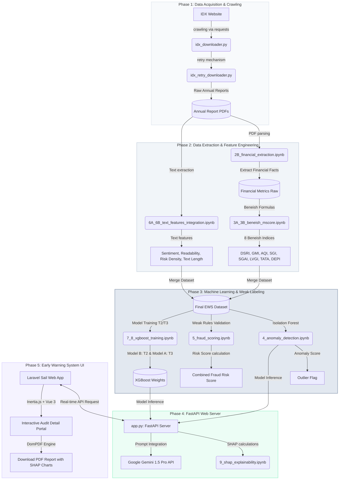

# 🛡️ Early Warning System (EWS) Fraud Detection
### *A Data-Driven Financial Statement Fraud Detection & Explainable AI (XAI) Framework*

---

[](https://fastapi.tiangolo.com/)
[](https://laravel.com/)
[](https://xgboost.readthedocs.io/)
[](https://shap.readthedocs.io/)
[](https://ai.google.dev/)

Repository ini memuat rancangan riset berbasis data (*data-driven research*) untuk mendeteksi potensi kecurangan (*fraud*) pada laporan keuangan emiten di Bursa Efek Indonesia (BEI). Sistem mengintegrasikan metode **Machine Learning (XGBoost & Isolation Forest)**, **Natural Language Processing (NLP)** untuk analisis narasi laporan tahunan, **Explainable AI (SHAP)** untuk transparansi model, serta **Generative AI (Gemini 1.5 Pro)** untuk komentar eksekutif audit otomatis. Seluruh kapabilitas ini disajikan melalui web dashboard interaktif berbasis **Laravel, Vue.js (Inertia.js), dan Tailwind CSS**.

---

## 🗺️ Arsitektur & Alur Pipeline Proyek

Alur kerja proyek dirancang dari hulu ke hilir secara sistematis, terbagi ke dalam 3 folder utama:
1. **`Data_Crawling`**: Pengambilan data mentah dari Bursa Efek Indonesia (IDX).
2. **`Dashboard_EWS`**: Engine data science, pemodelan machine learning, analisis SHAP, dan FastAPI backend.
3. **`ews_dashboard`**: Portal aplikasi web audit visual (Laravel + Vue.js).

### Visualisasi Alur Data & Pipeline Sistem



---

## 🛠️ Rincian Proses & Alur Pengerjaan

### 📂 1. Data Crawling (Akuisisi Laporan Tahunan)
*   **IDX Downloader**: Script [`idx_downloader.py`](file:///c:/Users/MMASZZS123/Documents/Website%20VibeCode/PUI-PT/Data_Crawling/idx_downloader.py) melakukan unduhan otomatis terhadap dokumen laporan tahunan (Annual Report) berformat PDF langsung dari server IDX berdasarkan daftar emiten yang tercantum di [`Rekap_Perusahaan_2021_2024.xlsx`](file:///c:/Users/MMASZZS123/Documents/Website%20VibeCode/PUI-PT/Data_Crawling/Rekap_Perusahaan_2021_2024.xlsx).
*   **Retry Mechanism**: Untuk mengatasi pembatasan laju (*rate-limiting*) dan kegagalan jaringan, [`idx_retry_downloader.py`](file:///c:/Users/MMASZZS123/Documents/Website%20VibeCode/PUI-PT/Data_Crawling/idx_retry_downloader.py) berjalan sebagai agen ketahanan untuk mengunduh ulang dokumen yang gagal hingga seluruh inventori terpenuhi.

### 📂 2. Ekstraksi Metrik Keuangan & Beneish M-Score
*   **Financial Extraction**: Pada file notebook [`2B_financial_extraction.ipynb`](file:///c:/Users/MMASZZS123/Documents/Website%20VibeCode/PUI-PT/Dashboard_EWS/2B_financial_extraction.ipynb), fakta-fakta angka kunci (seperti *Total Assets, Cash Flow from Operations, Net Income, Revenue, Receivables, Depreciation*) diekstrak secara otomatis dari PDF laporan keuangan.
*   **Beneish M-Score**: Melalui [`3A_3B_beneish_mscore.ipynb`](file:///c:/Users/MMASZZS123/Documents/Website%20VibeCode/PUI-PT/Dashboard_EWS/3A_3B_beneish_mscore.ipynb), program menghitung 8 indeks krusial untuk mendeteksi manipulasi laba:
    *   **DSRI** (*Days Sales in Receivables Index*) — Mengukur lonjakan piutang yang tidak proporsional dibanding penjualan.
    *   **GMI** (*Gross Margin Index*) — Mengukur penurunan margin laba kotor yang memicu tekanan manipulasi.
    *   **AQI** (*Asset Quality Index*) — Mengukur peningkatan aset non-fisik (potensi penangguhan biaya).
    *   **SGI** (*Sales Growth Index*) — Mengukur pertumbuhan penjualan yang tidak biasa.
    *   **SGAI** (*Sales General & Admin Expenses Index*) — Rasio efisiensi biaya administrasi.
    *   **LVGI** (*Leverage Index*) — Rasio utang terhadap total aset (tekanan dari kreditur).
    *   **TATA** (*Total Accruals to Total Assets*) — Mengukur porsi laba bersih yang disokong akrual alih-alih arus kas riil.
    *   **DEPI** (*Depreciation Index*) — Mengukur penurunan tingkat depresiasi aset.

### 📂 3. Ekstraksi Fitur Teks & Analisis Sentimen (NLP)
*   **Annual Report Text Mining**: Melalui notebook [`6A_6B_text_features_integration.ipynb`](file:///c:/Users/MMASZZS123/Documents/Website%20VibeCode/PUI-PT/Dashboard_EWS/6B_text_features_integration.ipynb), sistem mengekstrak konten tekstual laporan tahunan untuk mengukur:
    *   **Sentiment Score** — Nada bahasa manajemen (optimis vs pesimis/defensif).
    *   **Risk Words Density** — Kerapatan kata-kata berisiko (seperti *krisis, rugi, ketidakpastian, litigasi*).
    *   **Readability Index** — Tingkat keterbacaan laporan (laporan yang sengaja dibuat rumit sering kali berkorelasi dengan upaya penyembunyian fakta kecurangan).
    *   **Text Length** — Panjang teks laporan tahunan secara keseluruhan.

### 📂 4. Deteksi Anomali & Pelabelan Lemah (Weak Labeling)
*   **Isolation Forest**: Melalui [`4_anomaly_detection.ipynb`](file:///c:/Users/MMASZZS123/Documents/Website%20VibeCode/PUI-PT/Dashboard_EWS/4_anomaly_detection.ipynb), model tanpa pengawasan (*unsupervised*) dilatih untuk mendeteksi entitas outlier multivariat yang memiliki pola keuangan menyimpang secara ekstrem dari data populasi. Hasilnya disimpan di [`model_iso_05.joblib`](file:///c:/Users/MMASZZS123/Documents/Website%20VibeCode/PUI-PT/Dashboard_EWS/model_iso_05.joblib).
*   **Weak Labeling Rules (T2 & T3)**: Karena ketiadaan label kecurangan historis yang mutlak (*ground-truth*), penelitian ini memformulasikan sistem pelabelan lemah (*weak labeling*) berdasarkan 5 Aturan Audit:
    1.  *Rule 1*: Beneish M-Score > -2.22 (Probabilitas tinggi manipulasi laba).
    2.  *Rule 2*: Isolation Forest Anomaly Score > 0.3 (Outlier ekstrim).
    3.  *Rule 3*: Narrative Risk Score > 60 (Tingginya kata risiko/kerumitan bahasa laporan tahunan).
    4.  *Rule 4*: Kualitas Kas Buruk (Operating Cash Flow jauh lebih rendah dibanding Net Income).
    5.  *Rule 5*: Penjualan Ekstrem (Sales Growth > 30%).
*   Sistem menetapkan label target **Model A (T3)** apabila minimal 3 aturan terpicu, dan **Model B (T2)** apabila minimal 2 aturan terpicu.

### 📂 5. Pemodelan Machine Learning (XGBoost) & SHAP Explainability
*   **XGBoost Classifier**: Program melatih algoritma *gradient boosting* pada [`7_8_xgboost_training.ipynb`](file:///c:/Users/MMASZZS123/Documents/Website%20VibeCode/PUI-PT/Dashboard_EWS/8_xgboost_training.ipynb) untuk memprediksi probabilitas kecurangan berdasarkan 16 fitur gabungan numerik & narasi. Bobot model disimpan sebagai [`model_xgb_a70.joblib`](file:///c:/Users/MMASZZS123/Documents/Website%20VibeCode/PUI-PT/Dashboard_EWS/model_xgb_a70.joblib) dan [`model_xgb_b80.joblib`](file:///c:/Users/MMASZZS123/Documents/Website%20VibeCode/PUI-PT/Dashboard_EWS/model_xgb_b80.joblib).
*   **SHAP Explainability**: Mengatasi masalah *black-box* pada machine learning, notebook [`9_shap_explainability.ipynb`](file:///c:/Users/MMASZZS123/Documents/Website%20VibeCode/PUI-PT/Dashboard_EWS/9_shap_explainability_a70.ipynb) mengalkulasi nilai SHAP (*Shapley Additive exPlanations*) untuk mengukur kontribusi spesifik setiap metrik keuangan atau tekstual terhadap kenaikan/penurunan risiko kecurangan suatu emiten.

### 📂 6. FastAPI Web Server Integration
*   Backend python berjalan sebagai microservice menggunakan FastAPI ([`app.py`](file:///c:/Users/MMASZZS123/Documents/Website%20VibeCode/PUI-PT/Dashboard_EWS/app.py)) di port `8000`.
*   Server menyediakan endpoint `/predict` yang menerima parameter 16 fitur emiten, menghitung probabilitas kecurangan menggunakan model XGBoost, menghitung nilai kontribusi lokal SHAP untuk fitur-fitur teratas, serta mengirimkan prompt terstruktur ke **Google Gemini 1.5 Pro API** untuk menghasilkan penjelasan naratif audit secara real-time.

### 📂 7. Laravel & Vue.js Early Warning System Dashboard
*   Aplikasi web utama dibangun menggunakan **Laravel Sail (Docker)** di port `8010` dengan frontend **Vue 3 (Inertia.js)** dan **Tailwind CSS**.
*   **Halaman Utama (Dashboard)**: Menyajikan tabel emiten dengan detail skor risiko gabungan (Combined Fraud Score), M-Score, hasil verifikasi aturan weak label, serta tombol aksi audit cepat.
*   **Audit Detail (Show Page)**: Menyediakan panel analisis interaktif terbagi menjadi 5 modul utama:
    1.  *Financial Metrics*: Grafik komparatif historis metrik keuangan dan Beneish M-Score.
    2.  *Narrative Sentiment*: Visualisasi keterbacaan laporan tahunan, kerapatan kata risiko, dan nada bahasa sentimen.
    3.  *Weak Label Audit & SHAP*: Evaluasi pemenuhan 5 aturan audit dan visualisasi bar kontribusi parameter SHAP lokal (apakah parameter meningkatkan atau menurunkan tingkat risiko).
    4.  *AI Commentary (Gemini LLM)*: Narasi rekomendasi audit otomatis dari model bahasa besar (LLM).
    5.  *Export Report*: Tab khusus untuk mengunduh laporan audit resmi dalam format PDF yang rapi dan mencakup seluruh visualisasi data.

---

## 🎨 Tampilan UI Desain Dashboard EWS

Aplikasi ini mengusung desain bertema modern dengan skema warna **Sleek Slate Dark Mode & Clean Indigo/Rose Accent** yang nyaman dibaca oleh auditor profesional untuk analisis data intensif:

```
[Dashboard Utama]
 ├── Header: Pencarian Emiten, Filter Sektor & Tahun Fiskal
 ├── Ringkasan KPI: Total Emiten Diaudit, Entitas Risiko Tinggi, Rata-rata Anomali
 └── Tabel Risiko: Kode | Emiten | Tahun | M-Score | Fin Risk | Narr Risk | Combined | Model A/B | Aksi

[Halaman Detail Audit]
 ├── Info Panel: Profil Perusahaan, Sektor, Status Risiko
 ├── Tab Panel:
 │    ├── 📈 Financial & Beneish Indices
 │    ├── 📊 Narrative Sentiment Analysis
 │    ├── 🔍 Weak Label Rules & SHAP Drivers
 │    ├── 🤖 AI Executive Commentary
 │    └── 📥 Export Report
```

---

## 🚀 Panduan Instalasi & Menjalankan Project

### Prasyarat:
*   Docker & Docker Desktop (untuk Laravel Sail)
*   Python 3.10+ (untuk FastAPI & Machine Learning environment)
*   API Key dari Google Gemini (untuk fitur AI Commentary)

### 🐍 1. Menjalankan Machine Learning FastAPI Server
1. Masuk ke direktori `Dashboard_EWS`:
   ```bash
   cd Dashboard_EWS
   ```
2. Buat virtual environment dan instal dependensi:
   ```bash
   python -m venv venv
   source venv/bin/activate  # Untuk Windows: venv\Scripts\activate
   pip install -r requirements.txt
   ```
3. Buat file `.env` di dalam folder `Dashboard_EWS` dan tambahkan API Key Gemini Anda:
   ```env
   GEMINI_API_KEY=your_gemini_api_key_here
   ```
4. Jalankan server FastAPI menggunakan Uvicorn pada port `8000`:
   ```bash
   uvicorn app:app --host 0.0.0.0 --port 8000
   ```

### 🐳 2. Menjalankan Laravel Web Application via Sail
1. Masuk ke direktori `ews_dashboard`:
   ```bash
   cd ews_dashboard
   ```
2. Gandakan file `.env.example` menjadi `.env` dan sesuaikan koneksi database Anda.
3. Jalankan container Docker menggunakan Laravel Sail:
   ```bash
   ./vendor/bin/sail up -d
   ```
4. Jalankan migrasi database dan seed data awal:
   ```bash
   ./vendor/bin/sail artisan migrate --seed
   ```
5. Kompilasi aset frontend Vue 3 & Tailwind CSS:
   ```bash
   ./vendor/bin/sail npm run build
   ```
6. Akses aplikasi melalui peramban Anda di: `http://localhost:8010/dashboard`
   *   **Email Default**: `admin@ews.com`
   *   **Password Default**: `password`

---

## 📈 Metrik Data & Visualisasi Laporan PDF
Dokumen PDF laporan fraud yang diekspor menggunakan engine DomPDF pada Laravel memformat data agar siap dicetak secara profesional (*print-ready*):
*   **Page 1**: Berisi lembar ringkasan eksekutif emiten, skor risiko gabungan, evaluasi status pemicu 5 aturan weak label, serta prediksi probabilitas dari model XGBoost A & B.
*   **Page 2**: Berisi grafik pengaruh fitur lokal (SHAP Local Drivers), bagan **Global SHAP Feature Importance** berskala persentase, serta rekomendasi komparatif dari AI Gemini.

---

### *Pernyataan Desain Riset*
*Framework Early Warning System ini dirancang khusus untuk memenuhi standar penelitian data-driven akuntansi forensik modern. Gabungan metrik kuantitatif terstandar (Beneish M-Score) dengan analisis kualitatif berbasis bahasa natural (NLP) memberikan presisi deteksi fraud yang jauh lebih unggul dibandingkan analisis rasio konvensional.*
