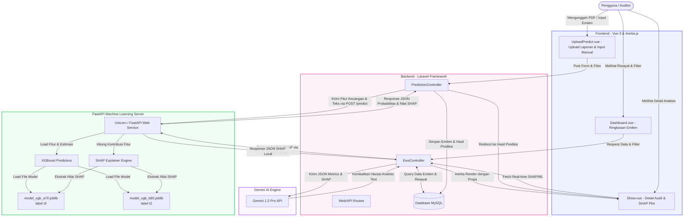

# Dokumentasi Arsitektur Sistem EWS (Early Warning System)

Dokumen ini menjelaskan arsitektur sistem, alur integrasi data, dan detail teknis dari aplikasi Early Warning System (EWS) Pendeteksi Risiko Fraud Laporan Keuangan Emiten.

---

## 1. Diagram Arsitektur Sistem

Berikut adalah representasi alur data dan interaksi antar komponen dalam sistem EWS, mulai dari interaksi pengguna di Frontend hingga inferensi Model Machine Learning & SHAP melalui FastAPI:



---

## 2. Alur Kerja & Aliran Data (Data Flow)

### Langkah 1: Input Data & Upload Laporan Keuangan
- Pengguna masuk ke modul **Upload & Predict** (`UploadPredict.vue`).
- Pengguna memilih kode emiten, tahun buku, dan mengunggah dokumen:
  - **Financial Statement** (PDF - Wajib)
  - **Annual Report** (PDF - Opsional)
- Sistem Laravel memeriksa database untuk menemukan data pembanding tahun sebelumnya (*lag t-1*). Jika tidak ditemukan, pengguna dapat memasukkan parameter lag secara manual di form override.

### Langkah 2: Ekstraksi Fitur & Hitung Metrik Keuangan di Laravel
- Laravel memproses file PDF dan menyimpan catatan ke database.
- Laravel menghitung secara otomatis rasio **Beneish M-Score** (8 Indeks):
  - **DSRI**: *Days Sales in Receivables Index*
  - **GMI**: *Gross Margin Index*
  - **AQI**: *Asset Quality Index*
  - **SGI**: *Sales Growth Index*
  - **LVGI**: *Leverage Index*
  - **DEPI**: *Depreciation Index*
  - **SGAI**: *Sales General & Administrative Expenses Index*
  - **TATA**: *Total Accruals to Total Assets*
- Laravel juga menghitung metrik **Isolation Forest Anomaly** dan indeks analisis teks (seperti frekuensi kata berisiko, keterbacaan MD&A, dan skor sentimen laporan tahunan).

### Langkah 3: Inferensi Model ML & SHAP via FastAPI
- Laravel mengirimkan data fitur keuangan dan teks yang sudah dihitung ke Server FastAPI melalui HTTP POST request.
- **FastAPI** memuat dua model XGBoost:
  1. **Model A (a70)**: Model XGBoost yang dilatih dengan pembagian data 70% dan target label `t3` (outlier/kasus fraud berat).
  2. **Model B (b80)**: Model XGBoost yang dilatih dengan pembagian data 80% dan target label `t2` (semua indikasi penyimpangan).
- FastAPI mengembalikan:
  - Nilai probabilitas fraud dari masing-masing model.
  - Label klasifikasi (`1` untuk Fraud, `0` untuk Normal).
  - Kontribusi fitur lokal (SHAP Values) dalam format JSON Waterfall.

### Langkah 4: AI Commentary Engine (Google Gemini 1.5 Pro)
- Setelah mendapatkan data dari database dan FastAPI, Laravel mengirimkan payload ringkasan metrik (Beneish Indices, ML Predictions, dan SHAP values) ke **API Google Gemini 1.5 Pro**.
- Gemini bertindak sebagai asisten analis yang menerjemahkan data mentah berbentuk JSON menjadi teks narasi analisis risiko eksekutif berbahasa Indonesia secara otomatis.
- Teks naratif ini kemudian disimpan di database dan dikirim sebagai props ke frontend.

### Langkah 5: Visualisasi di Frontend (`Show.vue`)
- Frontend Vue 3 menerima props dari Inertia.js dan merender halaman audit emiten:
  - **Risk Summary Cards**: Menampilkan Combined EWS Score, Financial Score, dan Narrative Score.
  - **Beneish Ratios block**: Menampilkan 8 kartu rasio keuangan beserta indikator bendera merah (*red flags*).
  - **SHAP Interactive Waterfall**: Menampilkan grafik kontribusi fitur (positif/negatif) untuk Model A dan Model B secara dinamis.
  - **AI Commentary Tab**: Menampilkan penjelasan naratif otomatis dari Gemini.

---

## 3. Struktur Pertukaran Data JSON (API Contract)

### Request Payload (Laravel -> FastAPI `/predict`)
```json
{
  "dsri": 10.0,
  "gmi": 1.9655,
  "aqi": 1.0403,
  "sgi": 10.0,
  "lvgi": 1.0186,
  "depi": 1.0,
  "sgai": 1.3751,
  "tata": -0.0877,
  "sentiment": -0.125,
  "risk_words": 150.0,
  "readability": 14.52
}
```

### Response Payload (FastAPI -> Laravel)
```json
{
  "status": "success",
  "predictions": {
    "model_a": {
      "prediction": 1,
      "probability": 0.842,
      "shap_values": [
        {"name": "DSRI", "value": 10.0, "weight": 2.45, "direction": "up", "impact": "+2.45 (High Receivables)"},
        {"name": "SGI", "value": 10.0, "weight": 1.92, "direction": "up", "impact": "+1.92 (Sales Growth Outlier)"}
      ]
    },
    "model_b": {
      "prediction": 1,
      "probability": 0.796,
      "shap_values": [
        {"name": "DSRI", "value": 10.0, "weight": 1.88, "direction": "up", "impact": "+1.88 (High Receivables)"}
      ]
    }
  }
}
```

---

## 4. Keuntungan Desain Arsitektur EWS
1. **Decoupled Architecture**: Logika bisnis dan database ditangani oleh Laravel, sedangkan pemrosesan model ML yang berat ditangani oleh FastAPI, sehingga tidak membebani server utama Laravel.
2. **Explainable AI (XAI)**: Penggunaan SHAP memastikan model tidak menjadi kotak hitam (*black box*), melainkan memberikan penjelasan transparan bagi auditor mengapa emiten tertentu ditandai sebagai fraud.
3. **Hybrid Risk Assessment**: Menggabungkan aturan tradisional (Beneish M-Score) dengan kecerdasan buatan (XGBoost) dan text mining (NLP) untuk tingkat akurasi yang lebih tinggi.
